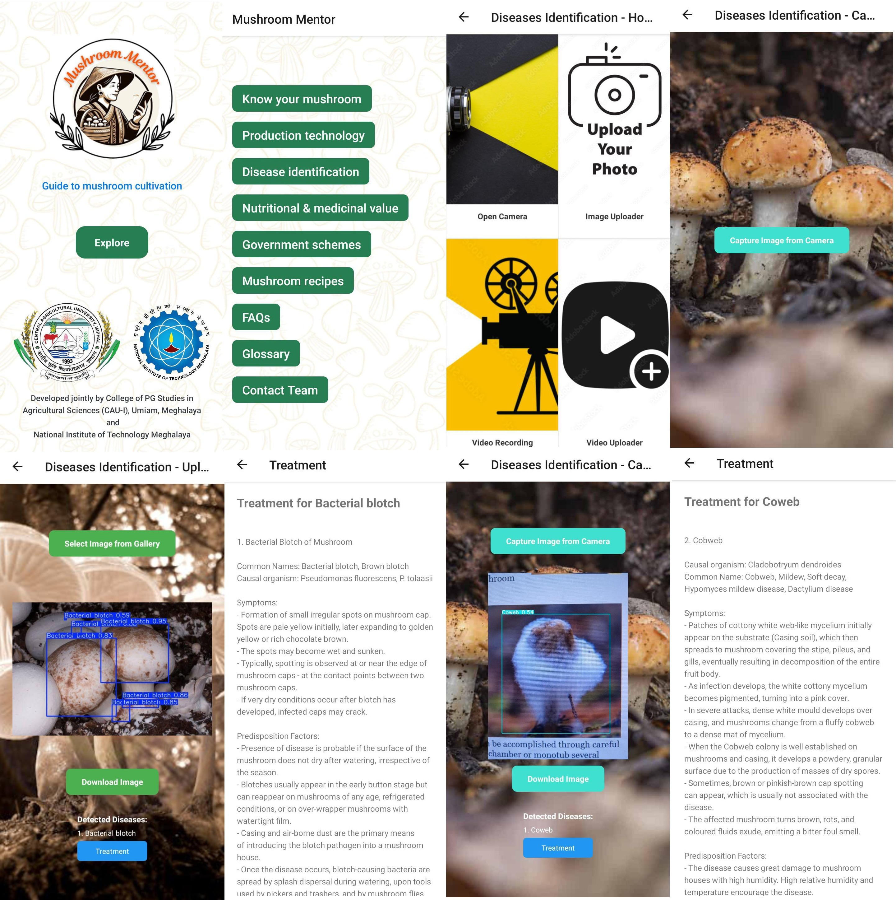

# 🍄 Mushroom Disease Detection App using YOLOv5

This project is an AI-powered application that detects and classifies diseases in mushrooms from images using the YOLOv5 object detection model. Designed to help farmers and researchers identify diseases early, the app provides fast, accurate results with an easy-to-use interface.



---

## 🚀 Features

- Real-time mushroom disease detection from images
- Lightweight and optimized YOLOv5 model
- Flask backend
- Mobile-friendly frontend (can be integrated with a React Native app)
- Easily extendable for other plant or fungal diseases

---

## 🛠️ Tech Stack

- **YOLOv5** (PyTorch)
- **Flask** (for backend API)
- **React Native** (for frontend app - optional)
- **OpenCV, PIL** for image processing

---

## 📦 Setup Instructions

### 1. Clone the Repository

```git clone https://github.com/AmartyaGhoshyoo/Mushroom-Diseases-Prediction-App.git```

### 2. Run the server

```cd "YoloV5 Server Code"```
```pip install -r requirements.txt```
```python -m waitress --host=0.0.0.0 --port=5000 --channel-timeout=200 server:app```

### 3. Get the app

```cd "Mushroom Disease Prediction"```
```cd android```
```./gradlew assembleRelease```

### Find the APK 
This will generate an APK in the following location:

```android/app/build/outputs/apk/release/app-release.apk```


